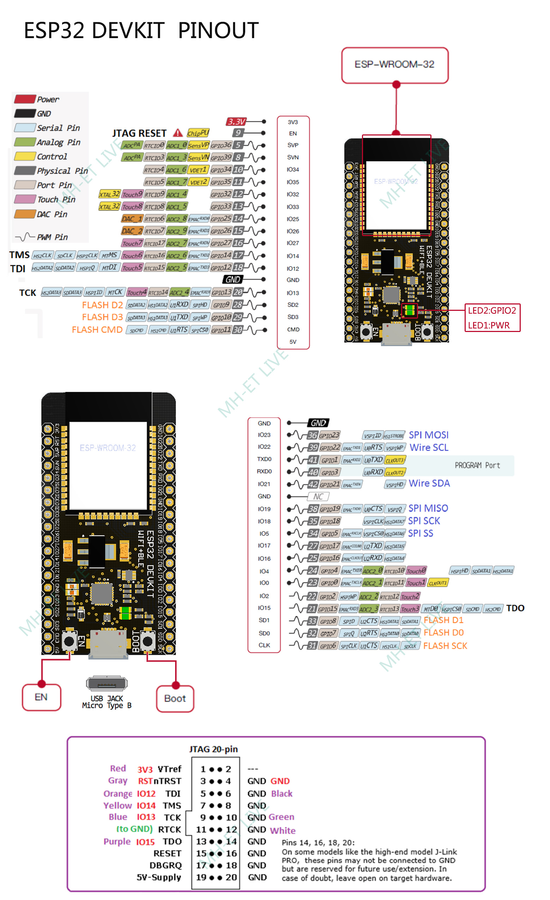

# Arduino core for ESP32 WiFi chip

[](https://travis-ci.org/espressif/arduino-esp32)

## Need help or have a question? Join the chat at [](https://gitter.im/espressif/arduino-esp32?utm_source=badge&utm_medium=badge&utm_campaign=pr-badge&utm_content=badge)

- [Development Status](#development-status)
- [Installation Instructions](#installation-instructions):
  + [Using Arduino IDE](#using-through-arduino-ide)
    + [Windows](https://github.com/espressif/arduino-esp32/blob/master/doc/windows.md)
    + [Mac OS](#instructions-for-mac)
    + [Debian/Ubuntu](#instructions-for-debianubuntu-linux)
    + [Decoding Exceptions](#decoding-exceptions)
  + [Using PlatformIO](#using-platformio)
  + [Using as ESP-IDF component](#using-as-esp-idf-component)
- [ESP32Dev Board PINMAP](#esp32dev-board-pinmap)

## Development Status
Most of the framework is implemented. Most noticable is the missing analogWrite. While analogWrite is on it's way, there are a few other options that you can use:
- 16 channels [LEDC](https://github.com/espressif/arduino-esp32/blob/master/cores/esp32/esp32-hal-ledc.h) which is PWM
- 8 channels [SigmaDelta](https://github.com/espressif/arduino-esp32/blob/master/cores/esp32/esp32-hal-sigmadelta.h) which uses SigmaDelta modulation
- 2 channels [DAC](https://github.com/espressif/arduino-esp32/blob/master/cores/esp32/esp32-hal-dac.h) which gives real analog output

## Installation Instructions

### Using through Arduino IDE

#### [Instructions for Windows](doc/windows.md)

#### Instructions for Mac
- Install latest Arduino IDE from [arduino.cc](https://www.arduino.cc/en/Main/Software)
- Open Terminal and execute the following command (copy->paste and hit enter):

  ```bash
  mkdir -p ~/Documents/Arduino/hardware/espressif && \
  cd ~/Documents/Arduino/hardware/espressif && \
  git clone https://github.com/espressif/arduino-esp32.git esp32 && \
  cd esp32/tools/ && \
  python get.py
  ```
- Restart Arduino IDE

#### Instructions for Debian/Ubuntu Linux
- Install latest Arduino IDE from [arduino.cc](https://www.arduino.cc/en/Main/Software)
- Open Terminal and execute the following command (copy->paste and hit enter):

  ```bash
  sudo usermod -a -G dialout $USER && \
  sudo apt-get install git && \
  wget https://bootstrap.pypa.io/get-pip.py && \
  sudo python get-pip.py && \
  sudo pip install pyserial && \
  mkdir -p ~/Arduino/hardware/espressif && \
  cd ~/Arduino/hardware/espressif && \
  git clone https://github.com/espressif/arduino-esp32.git esp32 && \
  cd esp32/tools/ && \
  python get.py
  ```
- Restart Arduino IDE

#### Instructions for Fedora
- Install the latest Arduino IDE from [arduino.cc](https://www.arduino.cc/en/Main/Software). `$ sudo dnf -y install arduino` will most likely install an older release.
- Open Terminal and execute the following command (copy->paste and hit enter):

  ```bash
  sudo usermod -a -G dialout $USER && \
  sudo dnf install git python3-pip python3-pyserial && \
  mkdir -p ~/Arduino/hardware/espressif && \
  cd ~/Arduino/hardware/espressif && \
  git clone https://github.com/espressif/arduino-esp32.git esp32 && \
  cd esp32/tools/ && \
  python get.py
  ```
- Restart Arduino IDE

#### Decoding exceptions

You can use [EspExceptionDecoder](https://github.com/me-no-dev/EspExceptionDecoder) to get meaningful call trace.

### Using PlatformIO

[PlatformIO](http://platformio.org) is an open source ecosystem for IoT
development with cross platform build system, library manager and full support
for Espressif ESP32 development. It works on the popular host OS: Mac OS X, Windows,
Linux 32/64, Linux ARM (like Raspberry Pi, BeagleBone, CubieBoard).

- [What is PlatformIO?](http://docs.platformio.org/page/what-is-platformio.html)
- [PlatformIO IDE](http://platformio.org/platformio-ide)
- Quick Start with [PlatformIO IDE](http://docs.platformio.org/page/ide/atom.html#quick-start) or [PlatformIO Core](http://docs.platformio.org/page/core.html)
- [Integration with Cloud and Standalone IDEs](http://docs.platformio.org/page/ide.html) -
  Cloud9, Codeanywehre, Eclipse Che (Codenvy), Atom, CLion, Eclipse, Emacs, NetBeans, Qt Creator, Sublime Text, VIM and Visual Studio
- [Project Examples](https://github.com/platformio/platform-espressif32/tree/develop/examples)
- [Using "Stage" (Git) version of Arduino Core](http://docs.platformio.org/page/platforms/espressif32.html#using-arduino-framework-with-staging-version)

### Building with make

[makeEspArduino](https://github.com/plerup/makeEspArduino) is a generic makefile for any ESP8266/ESP32 Arduino project.
Using make instead of the Arduino IDE makes it easier to do automated and production builds.

### Using as ESP-IDF component
- Download and install [esp-idf](https://github.com/espressif/esp-idf)
- Create blank idf project (from one of the examples)
- in the project folder, create a folder called components and clone this repository inside

    ```bash
    mkdir -p components && \
    cd components && \
    git clone https://github.com/espressif/arduino-esp32.git arduino && \
    cd .. && \
    make menuconfig
  ```
- ```make menuconfig``` has some Arduino options
    - "Autostart Arduino setup and loop on boot"
        - If you enable this options, your main.cpp should be formated like any other sketch

          ```arduino
          //file: main.cpp
          #include "Arduino.h"

          void setup(){
            Serial.begin(115200);
          }

          void loop(){
            Serial.println("loop");
            delay(1000);
          }
          ```

        - Else you need to implement ```app_main()``` and call ```initArduino();``` in it.

          Keep in mind that setup() and loop() will not be called in this case.
          If you plan to base your code on examples provided in [esp-idf](https://github.com/espressif/esp-idf/tree/master/examples), please make sure move the app_main() function in main.cpp from the files in the example.

          ```arduino
          //file: main.cpp
          #include "Arduino.h"

          extern "C" void app_main()
          {
              initArduino();
              pinMode(4, OUTPUT);
              digitalWrite(4, HIGH);
              //do your own thing
          }
          ```
    - "Disable mutex locks for HAL"
        - If enabled, there will be no protection on the drivers from concurently accessing them from another thread/interrupt/core
    - "Autoconnect WiFi on boot"
        - If enabled, WiFi will start with the last known configuration
        - Else it will wait for WiFi.begin
- ```make flash monitor``` will build, upload and open serial monitor to your board

## ESP32Dev Board PINMAP



## Hint

Sometimes to program ESP32 via serial you must keep GPIO0 LOW during the programming process

